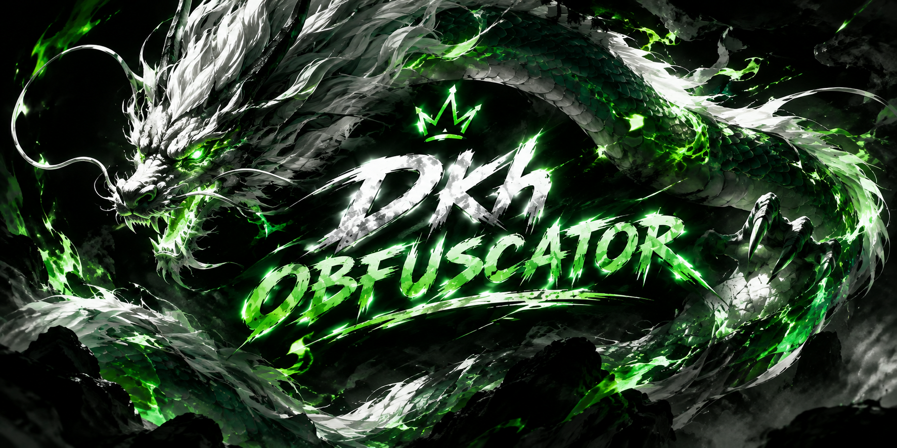
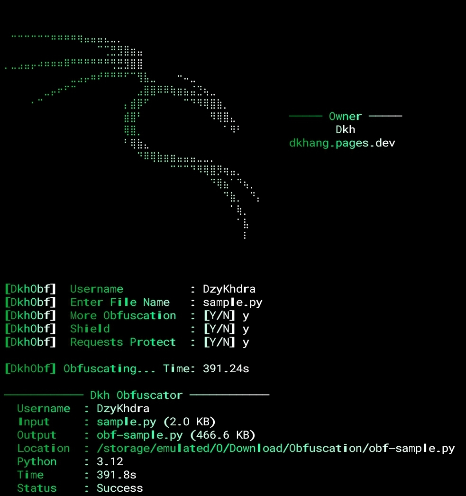

<div align="center">



# 🛡️ DkhObuscate

**Trình obfuscate mã nguồn Python mạnh mẽ — bảo vệ code khỏi bị đánh cắp, crack hoặc decompile ngược.**


</div>

---

## 📖 Giới thiệu

**DkhObuscate** là công cụ obfuscate (làm rối) mã nguồn Python nhiều lớp, giúp bảo vệ code của bạn khỏi việc bị đánh cắp mã nguồn, crack key,... **Tuy nhiên công cụ này là sản phầm từ AI**, chủ sở hữu đã vibe coding ra được sản phẩm này, có thể nó sẽ không bằng 1 sản phẩm code tay vì vậy mong các bạn không chê nó.


> ⚠️ **Những lưu ý quan trọng:** Công cụ này được tạo ra với mục đích bảo vệ mã nguồn hợp pháp. Tác giả không chịu trách nhiệm nếu công cụ bị sử dụng sai mục đích. Vui lòng sử dụng có trách nhiệm.

> [!NOTE]
> **1.** Do tôi vibe coding ngu nên thời gian obf file sẽ khá lâu, input càng nặng obf càng lâu vì vậy tôi chân thành xin lỗi các bạn.
> 
> **2.** Hiện tại Dkh Obfuscator **là mã nguồn đóng**, trong tương lai tôi chắc chắn sẽ mở cho các bạn sử dụng mã nguồn thoải mái.

---

## ✨ Tính năng

### 🔒 Các lớp obfuscate

- **Identifier Mangling** — Đổi tên toàn bộ biến, hàm, class thành ký tự Hiragana hoặc ASCII ngẫu nhiên được sinh từ seed — không thể đoán hay đặt ngược lại
- **String Protection** — Mã hóa tất cả chuỗi bằng lambda expression với XOR, modulo và phép nhân modular — không có chuỗi plaintext nào tồn tại trong output
- **WyrmFlow — Control Flow Transformation** — Biến đổi toàn bộ cấu trúc luồng điều khiển (if / loop / branch) thành dạng không thể theo dõi tuyến tính
- **Dkh VM v2 — Selective Virtualization** — Ảo hóa một phần code trong máy ảo tùy chỉnh với integer bị permute, thực thi qua bytecode riêng của VM
- **Opaque Predicates** — Chèn các điều kiện giả luôn đúng/sai mà decompiler không thể phân biệt — phá vỡ control flow graph
- **Boolean Algebra Obfuscation** — Biến đổi các biểu thức boolean thành dạng tương đương nhưng cực kỳ phức tạp về mặt cấu trúc
- **Builtins Indirection** — Ẩn toàn bộ truy cập vào built-in functions của Python (`len`, `print`, `range`...) qua nhiều lớp indirection
- **Integer Pool** — Obfuscate các hằng số nguyên thay vì để nguyên giá trị trực tiếp trong AST
- **Lambda Thunk** — Bọc các biểu thức trong lambda để trì hoãn thực thi và làm rối cấu trúc AST
- **Structural Expansion** — Mở rộng AST lên đến hàng trăm nghìn node, tăng độ phức tạp cấu trúc code theo cấp số nhân

---

### 🛡️ Bảo vệ Runtime

- **Shield (Anti-Debug + Anti-Hook + Anti-Dump)** — Phát hiện và chặn debugger, hook vào hàm, memory dump tại thời điểm chạy
- **Request Protect + Anti-Tamper Response** — Bảo vệ HTTP request trong code, phản ứng tức thì khi phát hiện bị giả mạo hoặc can thiệp
- **Runtime Guard** — Lớp bảo vệ runtime tổng quát, liên tục kiểm tra môi trường thực thi
- **Integrity Check** — Xác minh tính toàn vẹn của code mỗi khi chạy, phát hiện ngay nếu file output bị chỉnh sửa sau khi obfuscate
- **Memory Error Dispatch** — Phân tán và xử lý lỗi bộ nhớ để tránh bị khai thác làm điểm tấn công

---

### ⚙️ Hạ tầng Build

- **Seeded RNG (SHA-256)** — Mỗi build dùng seed ngẫu nhiên riêng — output khác nhau mỗi lần build dù input giống nhau
- **Payload Compression (zlib level 9)** — Nén payload output ở mức cao nhất
- **Build Validation** — Tự động thực thi file output sau khi build để xác nhận code vẫn hoạt động đúng trước khi trả về kết quả
- **Build Report** — Báo cáo kích thước input → output, expansion ratio, danh sách stage đã chạy
- **Username Watermark** — Nhúng username của bạn vào output như một dấu chủ quyền ẩn không thể xóa
- **Auto-install Dependencies** — Tự động cài toàn bộ thư viện còn thiếu khi khởi động — không cần setup thủ công
- **GUI + CLI** — Giao diện đồ họa (CustomTkinter) lẫn command-line, dùng theo cách nào cũng được
- **Yêu cầu chính xác Python 3.12** — Tối ưu hóa và kiểm thử chuyên biệt cho Python 3.12

---

## 🔧 Cách sử dụng

### 🖥️ Nếu bạn dùng máy tính

> **Bước 1 — Chuẩn bị**
> Đặt file `Dkh312.py` và file input (ví dụ: `xxx.py`) vào **cùng một thư mục**.

> **Bước 2 — Chạy công cụ**
> Mở terminal tại thư mục đó và chạy:
> ```bash
> python Dkh312.py
> ```
> *(Dkh312 sẽ tự động cài tất cả các thư viện còn thiếu — không cần làm gì thêm.)*

> **Bước 3 — Nhập thông tin**
> Chương trình sẽ hỏi lần lượt:
> - Tên **Username** của bạn
> - Tên **file input** (ví dụ: `xxx.py`)
> - Các tùy chọn **y/n** theo ý muốn
>
> Vậy là xong! 🎉

---

### 📱 Nếu bạn dùng điện thoại (Termux)

> **Bước 1 — Chuẩn bị**
> Đặt file `Dkh312.py` và file input (ví dụ: `xxx.py`) vào **cùng một thư mục**.

> **Bước 2 — Chạy công cụ**
> Mở một session Termux, điều hướng đến thư mục chứa file và chạy:
> ```bash
> python Dkh312.py
> ```
> *(Dkh312 sẽ tự động cài tất cả các thư viện còn thiếu — không cần làm gì thêm.)*

> **Bước 3 — Nhập thông tin**
> Chương trình sẽ hỏi lần lượt:
> - Tên **Username** của bạn
> - Tên **file input** (ví dụ: `xxx.py`)
> - Các tùy chọn **y/n** theo ý muốn
>
> Vậy là xong! 🎉

> [!NOTE]
> 📌 File `Dkh312.py` **phải nằm chung thư mục** với file input bạn muốn obfuscate.

---

## 🎬 Demo

<div align="center">



</div>

| File | Mô tả |
|---|---|
| [`sample.py`](sample.py) | File Python gốc trước khi obfuscate |
| [`obf-sample.py`](obf-sample.py) | File sau khi obfuscate bằng DkhObuscate |

---

## ❓ FAQ

**File sau khi obfuscate có chạy chậm hơn không?**
Có thể chậm hơn một chút.

**Có thể deobfuscate ngược lại không?**
Có, không 1 obfuscate nào thuần python không thể deobuscate, huống hồ chi obfuscate của tôi chưa chắc đã là vô địch thiên hạ.

**Công cụ có hỗ trợ Python 3.12 không?**
Không. DkhObuscate yêu cầu chính xác **Python 3.12** — không hơn, không kém.

**Output có thể chạy trên máy khác không?**
Có, miễn là máy đó cũng cài Python 3.12.


---

## 📌 Future Plans

- [ ] Nâng cao mức độ obfuscate.
- [ ] Bảo vệ mã nguồn cứng hơn.
- [ ] Phát triển rộng cho những version python khác.

---

## 📄 License

© 2026 **DzyKhdra**. All rights reserved.

Toàn bộ quyền thuộc về tác giả. Không được phép sao chép, sửa đổi, phân phối lại hoặc sử dụng dưới bất kỳ hình thức nào nếu không có sự cho phép bằng văn bản từ tác giả.

---

<div align="center">

Made with 🖤 by **DzyKhdra**

</div>
